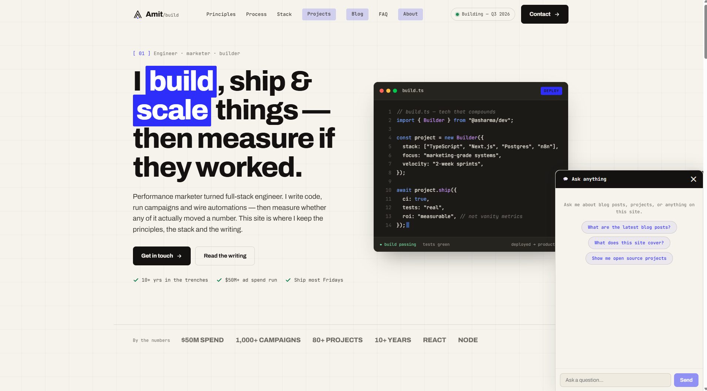
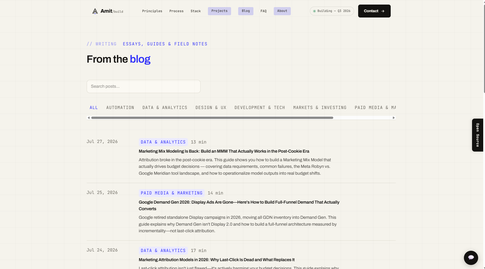
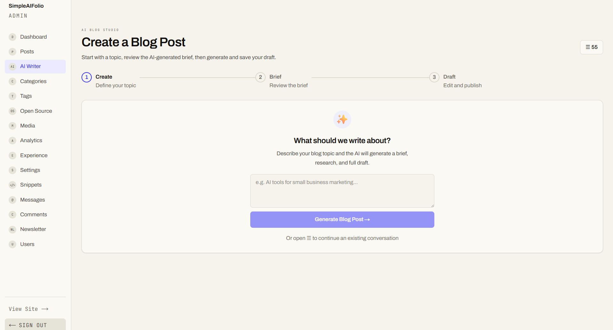
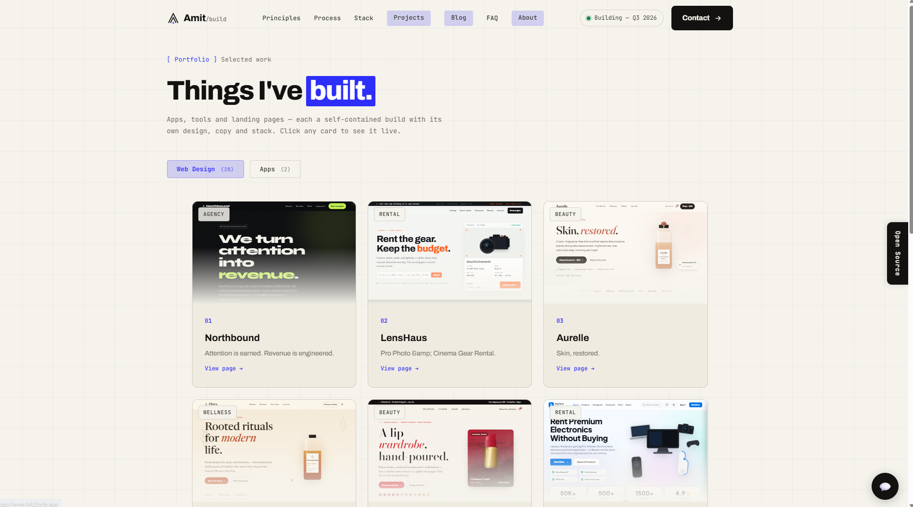
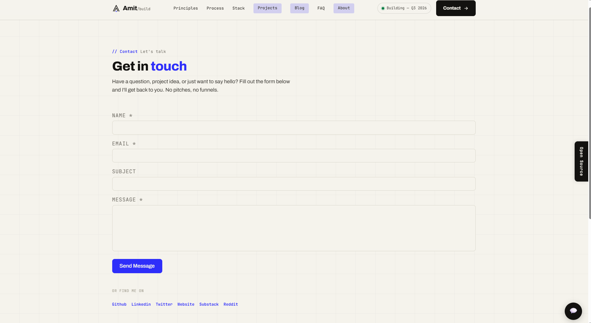



# SimpleAIFolio

<p>
  
  
  
  
  <br>
  
  
  
  
  <br>
  
  
  
</p>

A full-stack portfolio and blog platform with a built-in CMS, AI blog studio, and an MCP server — so you can manage your entire site from any AI tool (Claude Code, ChatGPT, Cursor, Windsurf).

**What makes it different:** Every feature in the admin panel is also accessible via MCP tools. You can create blog posts, manage open-source projects, check analytics, edit the landing page, and configure a chatbot — all through a chat interface in your favorite AI tool.

**Built for AI search (GEO):** Every blog post ships with structured data optimized for Google AI Overviews, ChatGPT Search, and Perplexity — FAQPage schema (auto-extracted from your FAQ section), BreadcrumbList, an enhanced BlogPosting with author E-E-A-T signals, and a TL;DR "key takeaways" box the AI auto-generates and renders at the top of each post.

**AI Chatbot:** A built-in website chatbot uses LLM function calling (not RAG) with 13 tools to answer visitor questions about your blog posts, projects, skills, FAQ, and more — zero hardcoded data, all real-time from your database.

**Live demo:** [bit2byte.app](https://bit2byte.app/) | **Follow:** [X/Twitter](https://x.com/bit2byteapp) · [LinkedIn](https://www.linkedin.com/in/bit2byte/) · [Substack](https://substack.com/@bit2byteapp) · [GitHub](https://github.com/asharma02192)

---

## Demo

https://github.com/user-attachments/assets/aca6f081-9c8f-4cef-be3d-dfcd41df68f0

| Blog | Dashboard |
|------|-----------|
|  |  |

| Portfolio | Contact |
|-----------|---------|
|  |  |

---

## Table of Contents

- [Prerequisites](#prerequisites)
- [Quick Start (Docker)](#quick-start-docker)
- [First-Time Setup](#first-time-setup)
- [Connecting AI Tools via MCP](#connecting-ai-tools-via-mcp)
- [AI Blog Studio Setup](#ai-blog-studio-setup)
- [Production Deployment](#production-deployment)
- [Environment Variables Reference](#environment-variables-reference)
- [Development Setup](#development-setup)
- [Testing](#testing)
- [Project Structure](#project-structure)
- [Features Overview](#features-overview)
- [Troubleshooting](#troubleshooting)
- [License](#license)

---

## Prerequisites

Before you begin, make sure you have:

| Requirement | Version | Check with | Install |
|-------------|---------|------------|---------|
| **Docker** | 24+ | `docker --version` | [docker.com](https://docker.com) |
| **Docker Compose** | 2+ | `docker compose version` | Included with Docker Desktop |
| **Git** | 2+ | `git --version` | [git-scm.com](https://git-scm.com) |

That's all you need for the Docker deployment. If you want to develop locally without Docker, you'll also need Node.js 20+ and PostgreSQL 16+.

---

## Quick Start (Docker)

This is the recommended way to deploy. One command starts everything.

### Step 1: Clone the repository

```bash
git clone https://github.com/asharma02192/SimpleAIFolio.git
cd SimpleAIFolio
```

### Step 2: Create your configuration file (required)

```bash
cp .env.example .env
```

**You must do this before starting Docker** — the stack will not start without it.

Open `.env` in your editor and set these **required** values:

```bash
# Generate secure secrets (run this in your terminal):
openssl rand -hex 32    # use output for JWT_SECRET
openssl rand -hex 32    # use output for REVALIDATE_SECRET

DB_PASSWORD=your-secure-db-password
JWT_SECRET=paste-the-first-random-string-here
REVALIDATE_SECRET=paste-the-second-random-string-here

# Your admin login (change the password!):
SEED_ADMIN_EMAIL=admin@example.com
SEED_ADMIN_PASSWORD=your-secure-password
SEED_ADMIN_NAME=Your Name
```

### Step 3: Start everything

```bash
docker compose up -d --build
```

This builds and starts 4 containers:

| Service | Port | Purpose |
|---------|------|---------|
| **Frontend** (Next.js) | `:3200` | Your website + admin panel |
| **Backend** (Express API) | `:3201` | REST API, auth, database access |
| **Database** (PostgreSQL) | `:5432` | Data storage |
| **MCP Server** | `:3100` | AI tool integration |

The first build takes 3-5 minutes. Subsequent restarts are instant.

### Step 4: Verify it's running

```bash
# Check all containers are healthy
docker compose ps

# Test the API
curl http://localhost:3201/api/health
# Should return: {"status":"ok"}

# Test the MCP server
curl http://localhost:3100/health
# Should return: {"status":"ok","tools":67,"resources":6,"prompts":6}
```

Now open your browser:
- **Your website**: http://localhost:3200
- **Admin panel**: http://localhost:3200/admin (log in with your `SEED_ADMIN_EMAIL` and `SEED_ADMIN_PASSWORD`)

---

## First-Time Setup

Your site starts with placeholder content. You have two ways to customize it:

### Option A: Manual Setup (Admin Panel)

1. Go to **http://localhost:3200/admin** and log in
2. Navigate to **Settings** (left sidebar)
3. Under **Home Page**: Set your bio text and hero stats
4. Under **About Page**: Write your bio paragraphs
5. Under **Site Wide**: Set site title, tagline, social links, and choose a theme
6. Go to **Experience** to add your work history
7. Go to **Projects** to add portfolio items
8. Go to **Posts** to write blog posts

### Option B: AI Onboarding (Recommended — 5 minutes)

Connect an AI tool to the MCP server (instructions below), then simply type:

> **"Set up my portfolio"**

The onboarding agent will:
1. Ask you about yourself (name, profession, skills, experience, projects)
2. Check what already exists to avoid duplicates
3. Populate your entire site — settings, skills, experience, projects, categories
4. Verify everything saved correctly
5. Give you a summary with next steps

No manual data entry needed.

---

## Connecting AI Tools via MCP

The MCP (Model Context Protocol) server exposes 67 tools that let AI assistants manage your site. Here's how to connect each tool:

### Find Your Connection Details

1. Go to **Admin > Settings > Site Wide tab**
2. Scroll down to **MCP Server** section
3. You'll see:
   - **Connection URL** (e.g., `http://localhost:3100/mcp`)
   - **API Key** (masked, with a copy button)
   - **Regenerate Key** button (invalidates all existing connections)

### Claude Code / Claude Desktop

Add this to your MCP configuration file:

**File location:**
- Claude Code: `~/.claude/mcp_settings.json` (or Settings > MCP in the UI)
- Claude Desktop: `~/Library/Application Support/Claude/claude_desktop_config.json` (macOS) or `%APPDATA%\Claude\claude_desktop_config.json` (Windows)

```json
{
  "mcpServers": {
    "SimpleAIFolio": {
      "command": "node",
      "args": ["/path/to/SimpleAIFolio/mcp-server/dist/index.js"],
      "env": {
        "MCP_API_URL": "http://localhost:3201",
        "MCP_AUTH_EMAIL": "admin@example.com",
        "MCP_AUTH_PASSWORD": "your-admin-password"
      }
    }
  }
}
```

Restart Claude after saving. You'll see "SimpleAIFolio" in the connected servers list.

**For remote VPS deployments**, use `mcp-remote` to bridge HTTP to stdio:

```json
{
  "mcpServers": {
    "SimpleAIFolio": {
      "command": "npx",
      "args": ["-y", "mcp-remote", "http://your-server:3100/mcp", "--header", "Authorization: Bearer your-api-key"]
    }
  }
}
```

### Cursor / Windsurf

Add to Settings > MCP:

```json
{
  "mcpServers": {
    "SimpleAIFolio": {
      "url": "http://localhost:3100/mcp",
      "headers": {
        "Authorization": "Bearer your-api-key"
      }
    }
  }
}
```

### ChatGPT / Custom HTTP Clients

```
Endpoint: POST http://localhost:3100/mcp
Headers:
  Content-Type: application/json
  Accept: application/json, text/event-stream
  Authorization: Bearer your-api-key
```

### What You Can Do Once Connected

Once connected, just talk naturally:

| You type... | What happens |
|-------------|-------------|
| "Set up my portfolio" | Onboarding agent interviews you and populates the site |
| "Write a blog post about Docker best practices" | AI creates a draft with SEO meta |
| "Publish the Docker post" | Post goes live immediately |
| "Schedule it for Monday 9am" | Post queued for auto-publish |
| "Show me this week's analytics" | Dashboard stats summarized |
| "Audit my content for SEO gaps" | Scans every post, flags issues |
| "How many newsletter subscribers do I have?" | Instant count + list |
| "Add a new project called 'AI Chatbot'" | Project created with tech stack |

See [`mcp-server/README.md`](./mcp-server/README.md) for the complete list of 67 tools, 6 resources, and 6 prompts.

**For AI agents:** Paste [`docs/AGENT_GUIDE.md`](./docs/AGENT_GUIDE.md) into your AI tool's system prompt or custom instructions. It documents every tool, parameter, resource, prompt, and common workflow so the agent knows exactly how to use the MCP server.

---

## AI Blog Studio Setup

The AI Blog Studio (at `/admin/ai-writer`) generates full blog posts from a topic. To enable it:

1. Go to **Admin > Settings > Site Wide > AI Configuration**
2. Set your AI provider details:

| Field | Example | Notes |
|-------|---------|-------|
| Provider | `openai-compatible` | Works with OpenAI, Azure, Groq, any OpenAI-compatible API |
| API Endpoint URL | `https://api.openai.com/v1` | The base URL of your AI provider |
| API Key | `sk-...` | Your API key (stored securely, never exposed to frontend) |
| Model | `gpt-4o` | Any model your provider supports |
| Temperature | `0.7` | 0 = precise, 2 = creative |
| Max Tokens | `6000` | Max response length |

3. Click **Save AI Config**
4. Go to **Admin > AI Writer** and start a conversation

The AI Blog Studio workflow:
1. Enter a topic → AI generates a **content brief** (audience, keywords, tone, expert angle, stance)
2. Review and approve the brief
3. Run **Exa research** (mandatory) → fetches live web sources, keyword ideas, content gaps
4. Review and approve research sources
5. AI generates a **full draft** (HTML content, SEO meta, FAQ, **TL;DR / key takeaways**, scores) — includes quality self-assessment. Generation is **async** (runs in the background, 3–7 min) — poll `get_draft_status` until ready.
6. Check **quality score** (1-10 across accuracy, depth, originality, voice, proof, SEO) — warn-only
7. Request **rewrites** (15 actions: improve intro, add code examples, add personal experience, make more opinionated, etc.). Rewrites are also **async** — `request_rewrite` returns immediately and the proposal is generated in the background; poll `get_ai_conversation` until the proposal status is `proposed`.
8. **Save to CMS** as a draft post

**Reliability:** All LLM calls use automatic network-error retry with exponential backoff and a per-call timeout, so transient connection drops (e.g. from your AI provider) self-heal instead of failing the generation.

### AI Writing Profile

To produce expert-quality drafts instead of generic SEO filler, configure your writing profile:

1. Go to **Admin > Settings > Site Wide > AI** tab
2. Scroll to **Writing Profile & Quality Standards**
3. Fill in:
   - **Author Credibility** — your real experience (roles, $ managed, projects)
   - **Reusable Stories** — concrete examples the AI can reference
   - **Strong Opinions** — your takes, preferred tools, contrarian positions
   - **Voice Rules** — tone guidelines (direct, no generic AI phrases)
   - **Proof Requirements** — what evidence you need (code, benchmarks, screenshots)
4. Click **Save Profile**

The AI injects this profile into every brief and draft. It **never fabricates** personal stories or numbers not in the profile — if evidence is missing, the draft includes a recommendation asking you to add it.

---

## GEO & AI Search Optimization

Blog posts are optimized for **Generative Engine Optimization** — getting cited by Google AI Overviews, ChatGPT Search, and Perplexity. Each published post automatically outputs:

| Structured data | What it does |
|-----------------|--------------|
| **FAQPage schema** | Auto-extracts Q&A pairs from your post's FAQ section into JSON-LD — the #1 signal AI engines use to cite answers |
| **Enhanced BlogPosting** | `dateModified`, author E-E-A-T (job title, bio, profile URL), publisher (org name + logo), and `image` |
| **BreadcrumbList schema** | Home → Blog → Category → Post breadcrumbs |
| **og:image / twitter:image** | Uses the post's featured/OG image, falling back to a dynamic title-rendered OG image |
| **Visible "Updated" date** | Shows last-modified date on the page when a post has been meaningfully updated |

### TL;DR / Key Takeaways box

Every post has an optional **TL;DR** field (under 150 words) that renders as a styled "Quick answer" box at the top of the post — easily parseable by AI extraction models. It's:

- **Auto-generated by the AI Writer** on every draft (optimized for AI search extraction)
- **Editable** in the admin post editor (a dedicated field)
- **Settable via MCP** (`create_post` / `update_post` accept a `tldr` parameter)
- Left blank → the box doesn't render

You can validate any post's structured data with [Google Rich Results Test](https://search.google.com/test/rich-results) or [validator.schema.org](https://validator.schema.org/).

---

## Custom Landing Page

The bare homepage (`/`) is served by a **standalone static landing page** — not the Next.js app. This lets you ship a fast, hand-crafted marketing page while the Next.js app powers the blog, portfolio, and admin.

### Hybrid routing

| URL | Served by |
|-----|-----------|
| `/` (exact root) | **Static landing page** (`landing/index.html`) |
| `/landing-assets/*` | Static assets from `landing/` |
| `/portfolio` | Static gallery page (`landing/portfolio.html`) |
| `/blog`, `/about`, `/projects`, `/contact`, `/api/*`, `/uploads/*`, `/admin`, `/feed.xml` | **SimpleAIFolio Next.js app** |

Only the *exact* root (`location = /`) is intercepted by the static page; everything else falls through to the Next.js frontend (exact-match wins over the prefix rule).

### The `landing/` directory

```
landing/
├── index.html       # marketing homepage served at /
├── portfolio.html   # template gallery served at /portfolio
├── styles.css
└── script.js
```

The `landing/` folder is **bind-mounted** into the gateway container (`./landing:/var/www/landing:ro` in `docker-compose.prod.yml`), so **edits take effect immediately** — just edit the files and reload the page. No rebuild or restart required.

### Customizing it

- Edit `landing/index.html` (and `styles.css` / `script.js`) to make the homepage your own.
- The Next.js app's homepage route (`/` in the frontend) is bypassed for the bare root, so change the homepage here, not in the frontend.
- If you'd rather have the Next.js app serve `/` instead, remove the `location = /` block from `deploy/nginx.conf`.

---

## Production Deployment

### Deploy to a VPS

1. **SSH into your server** and clone the repo:
   ```bash
   git clone https://github.com/asharma02192/SimpleAIFolio.git
   cd SimpleAIFolio
   ```

2. **Create and edit `.env`** with production values:
   ```bash
   cp .env.example .env
   nano .env
   ```
   Set strong passwords, secure secrets, and your admin credentials.

3. **Update URLs** for your domain:
   ```bash
   NEXT_PUBLIC_API_URL=https://api.yourdomain.com
   NEXT_PUBLIC_SITE_URL=https://yourdomain.com
   FRONTEND_URL=https://yourdomain.com
   ```

4. **Start the stack** — use the production compose file for secure network isolation:
   ```bash
   # Set the proxy network name (must match your reverse proxy's network)
   echo "EXTERNAL_PROXY_NETWORK=proxy_default" >> .env

   docker compose -f docker-compose.prod.yml up -d --build
   ```

   The production compose file configures three networks:
   - `app` (internal) — inter-service communication only, no internet
   - `egress` (bridge) — gives the backend outbound access for OpenAI, webhooks, etc.
   - `proxy` (external) — your reverse proxy joins this to reach frontend and backend

   This prevents the AI Blog Studio from failing with `EAI_AGAIN` errors caused by internal-only networking.

5. **Set up a reverse proxy** for HTTPS. See [`deploy/nginx.conf`](./deploy/nginx.conf) for a complete config with Docker DNS resolution (critical for container recreation without 502s).

   Key nginx directives:
   ```nginx
   resolver 127.0.0.11 valid=10s ipv6=off;

   location /api/ {
       proxy_pass http://backend:3001;
   }
   location / {
       proxy_pass http://frontend:3000;
   }
   ```

   Or use Caddy (automatic HTTPS):
   ```Caddyfile
   yourdomain.com {
       reverse_proxy frontend:3000
   }
   yourdomain.com {
       @api path /api/* /uploads/* /feed.xml
       handle @api {
           reverse_proxy backend:3001
       }
       handle {
           reverse_proxy frontend:3000
       }
   }
   ```

6. **Connect your AI tools** to `https://mcp.yourdomain.com/mcp` with your API key.

### Updating

```bash
git pull origin master
docker compose up -d --build
```

Your data persists in Docker volumes. Migrations run automatically on startup.

### Backing Up

```bash
# Backup database
docker compose exec db pg_dump -U SimpleAIFolio SimpleAIFolio > backup.sql

# Restore
docker compose exec -T db psql -U SimpleAIFolio SimpleAIFolio < backup.sql
```

---

## Environment Variables Reference

### Required

| Variable | Description | Example |
|----------|-------------|---------|
| `DB_PASSWORD` | PostgreSQL database password | `my-secure-password` |
| `JWT_SECRET` | JWT signing secret | Output of `openssl rand -hex 32` |
| `REVALIDATE_SECRET` | Frontend cache invalidation secret | Output of `openssl rand -hex 32` |
| `SEED_ADMIN_EMAIL` | Admin login email | `admin@example.com` |
| `SEED_ADMIN_PASSWORD` | Admin login password | `your-secure-password` |

### Optional

| Variable | Default | Description |
|----------|---------|-------------|
| `SEED_ADMIN_NAME` | `Admin` | Admin display name (also used as initial site title) |
| `NEXT_PUBLIC_API_URL` | `http://localhost:3201` | Public API URL (update for production) |
| `NEXT_PUBLIC_SITE_URL` | `http://localhost:3200` | Public site URL |
| `FRONTEND_URL` | `http://localhost:3200` | Used by backend for CORS/revalidation |

### AI Writer (configured via admin panel, not env vars)

Set these from **Admin > Settings > AI Configuration**:
- AI Provider (`openai-compatible` or `disabled`)
- API Key
- API Endpoint URL
- Model name
- Temperature and max tokens

---

## Development Setup

For local development without Docker:

### Prerequisites
- Node.js 20+
- PostgreSQL 16+
- npm or yarn

### Backend

```bash
cd backend
npm install

# Copy and edit environment
cp .env.example .env
# Set DATABASE_URL to your local PostgreSQL

# Run migrations
npx prisma migrate dev

# Start dev server
npm run dev
# Backend runs on http://localhost:3001
```

### Frontend

```bash
cd frontend
npm install

# Copy and edit environment
cp .env.example .env.local
# Set NEXT_PUBLIC_API_URL to your backend URL

# Start dev server
npm run dev
# Frontend runs on http://localhost:3000
```

### MCP Server

```bash
cd mcp-server
npm install
npm run build

# Run in stdio mode (for local testing)
MCP_API_URL=http://localhost:3001 \
MCP_AUTH_EMAIL=admin@example.com \
MCP_AUTH_PASSWORD=your-password \
node dist/index.js

# Or run the test suite
MCP_API_URL=http://localhost:3001 \
MCP_AUTH_EMAIL=admin@example.com \
MCP_AUTH_PASSWORD=your-password \
node dist/index.js --test
```

---

## Testing

### Backend API Tests

```bash
cd backend
npm test
```

### Frontend E2E Tests (Playwright)

```bash
cd frontend
npm run test:e2e
```

Environment overrides for tests:
- `PLAYWRIGHT_BASE_URL` — Frontend URL (default: `http://localhost:3200`)
- `PLAYWRIGHT_API_URL` — API URL (default: `http://localhost:3201`)
- `E2E_ADMIN_EMAIL` — Admin email for test login
- `E2E_ADMIN_PASSWORD` — Admin password for test login

### MCP Server Tests

```bash
cd mcp-server
npm run build

MCP_API_URL=http://localhost:3201 \
MCP_AUTH_EMAIL=admin@example.com \
MCP_AUTH_PASSWORD=your-password \
node dist/index.js --test
```

This runs end-to-end tests covering all 67 tools, 6 resources, and 6 prompts.

---

## Project Structure

```
SimpleAIFolio/
├── frontend/                  # Next.js 16 (App Router, SSR/ISR, Tailwind v4)
│   ├── src/
│   │   ├── app/              # App Router pages
│   │   │   ├── page.tsx      # Homepage (hero, skills, projects, blog)
│   │   │   ├── about/        # About page
│   │   │   ├── blog/         # Blog listing + individual posts
│   │   │   ├── projects/     # Projects listing + details
│   │   │   ├── contact/      # Contact form page
│   │   │   ├── search/       # Full-text search
│   │   │   ├── admin/        # Admin CMS (protected)
│   │   │   │   ├── dashboard/
│   │   │   │   ├── posts/    # Post editor with scheduling
│   │   │   │   ├── ai-writer/# AI Blog Studio
│   │   │   │   ├── media/    # Media library
│   │   │   │   ├── settings/ # Site configuration
│   │   │   │   └── ...       # Categories, tags, projects, etc.
│   │   ├── components/       # React components
│   │   └── lib/              # Config, API utilities
│   └── Dockerfile
│
├── backend/                   # Express 5 + Prisma 7
│   ├── src/
│   │   ├── routes/           # API endpoints (16 route files)
│   │   ├── services/         # AI, research, alerts
│   │   ├── middleware/       # Auth, rate limiting
│   │   └── seed.ts           # Clean seed (admin + settings only)
│   ├── prisma/
│   │   ├── schema.prisma     # Database schema
│   │   └── migrations/       # 10 migration files
│   ├── docker-entrypoint.sh  # Auto-runs migrations + seed on startup
│   └── Dockerfile
│
├── mcp-server/                # MCP server for AI tool integration
│   ├── src/
│   │   ├── tools/            # 67 tools (12 files)
│   │   ├── resources.ts      # 6 readable resources
│   │   ├── prompts.ts        # 6 prompt templates
│   │   ├── client.ts         # Backend API client (JWT auth)
│   │   └── index.ts          # Server entry + test runner
│   ├── Dockerfile
│   └── docker-compose.mcp.yml # Standalone MCP-only deployment
│
├── docker-compose.yml         # All 4 services (db, backend, frontend, mcp)
├── .env.example               # Configuration template
├── LICENSE
└── README.md
```

---

## Features Overview

### Website (Public)
- Fully CMS-driven landing page homepage (hero, principles, process, stats, stack, FAQ, CTA — all editable from admin/MCP)
- Custom design system (Forge Tech theme — paper background, ink text, electric ultramarine accent, Archivo + JetBrains Mono fonts)
- Single shared landing-style header/footer across all pages with mobile hamburger menu
- Vertical sticky "Open Source" tab on the right edge
- Blog with syntax-highlighted code blocks (Shiki), table of contents, reading progress bar
- TL;DR "Quick answer" box at the top of each post (auto-generated by AI Writer, editable)
- GEO structured data: FAQPage schema, BreadcrumbList, enhanced BlogPosting (dateModified, author E-E-A-T, publisher), og:image
- Open-source project directory (`/open-source`) with filtering, search, and detail pages
- Portfolio gallery (`/portfolio`) with template previews, tabs, and pagination — fully CMS-driven
- AI Chatbot — floating widget (bottom-right) using LLM function calling with 13 tools
- Post interactions: emoji reactions, comments, social sharing buttons
- Page view tracking with view counts
- Dynamic Open Graph images generated per blog post
- XML sitemap (includes blog, open-source, portfolio) and RSS feed
- Full-text search across posts
- Contact form with admin inbox
- Newsletter signup in footer
- Network-error retry with exponential backoff on all LLM calls

### Admin CMS (`/admin`)
- Dashboard with analytics (page views, top pages, AI usage stats, cost tracking, scheduled posts count)
- Post editor with scheduling, bulk select/delete, status filter, search, pagination, markdown import, TL;DR field
- Draft autosave (3-second debounce with saving indicator)
- Comment moderation page (approve/pending/spam with status filters and pagination)
- Category and tag management
- **Open-source project directory** (`/admin/opensource`) — add/edit/delete repos with stars, forks, license, topics, language, category
- Experience timeline editor
- Media library with automatic WebP conversion and thumbnail generation
- Contact message inbox with read/unread tracking
- Newsletter subscriber management
- Script snippet manager (inject GA4, GTM, Facebook Pixel, etc.)
- **Landing page editor** (`/admin/landing`, linked from Settings) — edit all homepage sections (hero, principles, process, stats, stack, FAQ, CTA, footer, nav) and portfolio items
- Site settings with sub-tabs: Home Page, About Page, Site Wide, **Chatbot**
  - Home Page: link to Landing editor (homepage is CMS-driven via `landing_content`)
  - About Page: bio paragraphs, skills (JSON editor)
  - Site Wide: General (site info, logo), Social (links, announcement bar), AI (provider config, Exa research, Writing Profile), MCP (API key), Account (profile, password)
  - **Chatbot**: enable/disable, model selection (editable), rate limit, quick suggestions, custom system prompt. API key/endpoint inherited from AI config (locked).
- User management with role-based access control
- MCP server configuration with API key management

### Multi-User Support
Three roles with different access levels:

| Role | Access |
|------|--------|
| **Admin** | Everything — all pages, settings, user management, MCP, AI config |
| **Editor** | Posts, projects, media, comments, categories, tags (no settings/users) |
| **Author** | Create and edit their own posts |

**How users join:** Admins add users directly from Admin > Users (name, email, password, role). The new user logs in at `/admin` with those credentials. Users can change their own password from Settings > Account.

### AI Blog Studio (`/admin/ai-writer`)
- Conversation-based blog writing with AI
- Structured content briefs with expert fields (audience, keywords, tone, expert angle, stance, proof requirements)
- Mandatory Exa web research before draft generation — all content grounded in live sources
- Full draft generation with SEO/engagement/readability scores
- **TL;DR auto-generation** — every draft includes a key takeaways summary (<150 words) for AI search optimization
- Quality self-assessment (1-10 across accuracy, depth, originality, voice, proof, SEO) — warn-only
- AI Writing Profile: injects author-specific evidence, opinions, and voice into drafts
- **Async draft generation** (3-7 min) and **async rewrites** (2-5 min) — both return immediately, poll for status
- **Network-error auto-retry** with exponential backoff on all LLM calls
- AI rewrite proposals (15 actions: improve intro, add code examples, add personal experience, make more opinionated, reduce generic AI tone, etc.)
- Research source collection with approval workflow
- Internal link suggestions from existing posts
- Verification flags for factual claims
- One-click save to CMS

### AI Chatbot (Website Widget)
- Floating chat widget on all public pages (bottom-right)
- Uses **LLM function calling** (not RAG) — 13 tools covering 100% of site content
- Zero hardcoded data — all responses from live database queries
- Functions: `get_site_info`, `get_recent_posts`, `search_blog`, `get_post`, `list_categories`, `list_tags`, `list_open_source`, `get_open_source_project`, `list_portfolio`, `get_faq`, `get_about_details`, `get_landing_section`, `get_announcement`
- Markdown rendering (no emojis), themed to match the site
- IP rate limiting (25 messages/hour, configurable)
- Configurable from Admin > Settings > Chatbot (model, suggestions, system prompt, rate limit)
- Uses the same API key/endpoint as the AI Writer (inherited, locked)

### MCP Server (68 tools, 6 resources, 6 prompts)
- Full CRUD for posts, open-source projects, categories, tags, experience, snippets
- **Open-source directory** (5 tools: list/get/create/update/delete)
- Comment moderation (list all, update status)
- User profile management
- Analytics dashboard, page views, top pages
- Newsletter subscriber management
- Contact message management
- **AI writer** with async draft generation + async rewrites + auto-retry
- AI writing profile management
- Site settings read/update (including landing_content, portfolio_items, chatbot config)
- Scheduled post publishing trigger
- Portfolio onboarding agent, content audit, weekly summary prompts
- Auto-deploys with Docker, API key auto-generated

---

## Troubleshooting

### Containers won't start

```bash
# Check logs
docker compose logs backend
docker compose logs frontend
docker compose logs mcp-server

# Restart everything
docker compose restart
```

### Database issues

```bash
# Reset database completely (WARNING: deletes all data)
docker compose down -v
docker compose up -d --build

# Check database connection
docker compose exec db pg_isready -U SimpleAIFolio
```

### MCP server not responding

```bash
# Check health
curl http://localhost:3100/health

# Check logs
docker compose logs mcp-server

# Verify API key is generated
docker compose exec backend curl -s http://localhost:3001/api/mcp-config
```

### Admin login doesn't work

The admin account is created on first startup from your `.env` file. If you changed `SEED_ADMIN_EMAIL` or `SEED_ADMIN_PASSWORD` after the first run:

```bash
# Reset everything and start fresh
docker compose down -v
docker compose up -d --build
```

### Port already in use

Edit `docker-compose.yml` and change the port mappings:
```yaml
ports:
  - "3300:3000"  # Change 3300 to any available port
```

### AI Blog Studio shows "not configured"

Go to **Admin > Settings > Site Wide > AI Configuration** and enter your OpenAI-compatible API details. The AI features are disabled by default.

---

## License

[MIT](./LICENSE) — Free to use, modify, and distribute.
